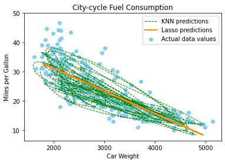

<!-- GETTING STARTED -->
## Predicting Fuel Consumption

The program:
- Drops the car name attribute.  
- Splits the data into 80% training and 20% testing sets.  
- Attributes horsepower has 6 missing values. Fill these up with the average 
horsepower for the respective number of cylinders. 
- Trains a poor model to predict mpg in such a way that the model 
intentionally overfits the training data.  
- Trains a better model that does not overfit the training data.  
- Generates a graph showing both models (poor and good) with the highest correlation with the mpg label, and in the y-axis the mpg.  

- Tests both models (poor and good) using the test set and reports the MSE for both models  

### Built With
* [Dataset](https://archive.ics.uci.edu/ml/datasets/Auto+MPG ) 
* [Python](https://reactjs.org/)
* [Numpy](https://github.com/facebook/create-react-app)
* [Pandas](https://pandas.pydata.org/)
* [Seaborn](https://seaborn.pydata.org/)
* [Sklearn](https://scikit-learn.org/)
