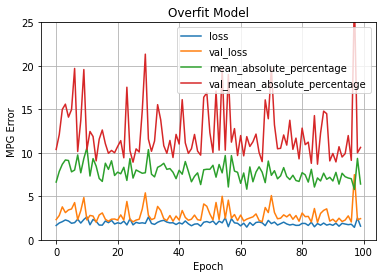
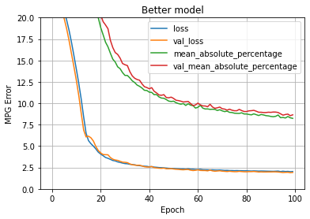

<!-- GETTING STARTED -->
## Predicting Fuel Consumption using Deep Neural Network

The program:
- Trains a poor deep neural network (DNN) model using 
keras.models.Sequential to predict mpg in such a way that the model intentionally overfits 
the training data usin 100 epochs. 
- Generates a graph that depicts loss and performance metric 
(e.g., mse, mae, or other) for both the training and the validation sets. 

## Poor model

## Good model

- Improves the model from (d) by changing some hyperparameters using 100 epochs. 
- Generates a second graph that depicts loss and 
performance metric for both the training and the validation sets. 

### Built With
* [Dataset](https://archive.ics.uci.edu/ml/datasets/Wine) 
* [Python](https://reactjs.org/)
* [Tensorflow](https://www.tensorflow.org/)
* [Pandas](https://pandas.pydata.org/)
* [Sklearn](https://scikit-learn.org/)
