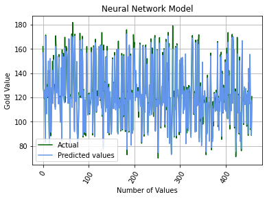

<!-- GETTING STARTED -->
##Frame the Problem and Look at The Big Picture

s. The machine learning models will be trained with the objective of predicting gold prices given its other stock prices. In order to analyze the data, numpy, pandas, matplotlib, seaborn, and sklearn are used.

- Date: MM/DD/YYYY
- SPX: The Standard & Poor’s 500 index represents 500
publicly traded countries in the United States
- GLD: SPDR Gold Shares, which are exchange-traded
funds of the SPDR family
- USO: United States Oil Price, a share exchange-traded
security
- SLV: Denotes the iShares Silver Trust (SLV) exchange
traded fund (ETF)
- EUR/USD: Currency pair of the Euro against the US dollar

### Exploring the data

## Performance
Three machine learning models, including SGD, Random Forest and DNN, were used to predict gold price based on other attributes. The performance of each model was analyzed based on a comparative experiment on the real-life dataset. Tuning several parameters ensured the validity and reliability of the results. Based on two metrics of RMSE and MAE, the performance of the three
models was assessed. It was determined that Random Forest was the best model. Overall, the Random Forest model presents itself as a promising machine learning model for predicting near-accurate values of the Gold Price Dataset.

### SGD

### Random Forest

### DNN

### Built With

* [React](https://reactjs.org/)
* [Create React App](https://github.com/facebook/create-react-app)
