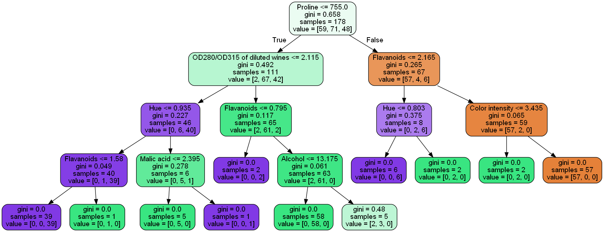

<!-- GETTING STARTED -->
## Predicting Wine Data

The program:
- Generates a binary decision tree of depth = 4  
- Generates a jpeg image of the tree 

- Tests both models (poor and good) using the test set and reports the MSE for both models  

### Built With
* [Dataset](https://archive.ics.uci.edu/ml/datasets/Wine) 
* [Python](https://reactjs.org/)
* [Tensorflow](https://www.tensorflow.org/)
* [Pandas](https://pandas.pydata.org/)
* [Sklearn](https://scikit-learn.org/)
